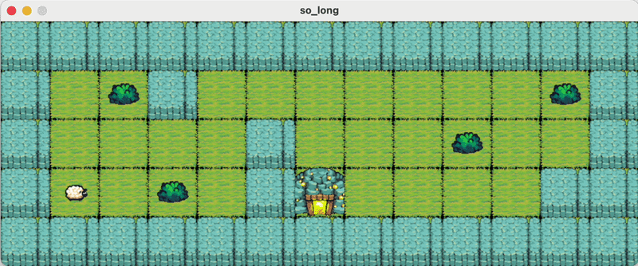

# 42 so_long

A small 2D top-down game written in C using MinilibX. The player navigates a grid map, collects every item, and then reaches the exit — while the move count is printed to the terminal after each step.



## Project Description

### Architecture overview

```
so_long/
├── main.c                      # Entry point: argument check, MLX init, event hooks
├── so_long.h                   # Structs, error macros, all function prototypes
├── utils.c                     # error_exit, free_double_array helpers
├── map.ber                     # Example map
├── map_validation/
│   ├── map_checker.c           # Extension, shape, wall, and component validation
│   ├── map_utils.c             # Map file reading and array construction
│   └── path_finder.c          # BFS reachability check
├── rendering/
│   ├── load_images.c           # XPM loading, full map draw, per-tile update
│   ├── move_player.c           # Movement logic for all four directions
│   └── utils.c                 # key_hook, win screen, move counter, close_game
├── assets/                     # XPM / PNG sprite files (64 × 64 px each)
├── libft/                      # Bundled custom C library
├── mlx_mac/                    # MinilibX for macOS
└── mlx_linux/                  # MinilibX for Linux
```

### Map validation pipeline

Each `.ber` file goes through five sequential checks before the window opens:

| Step | What is checked |
|------|-----------------|
| **Extension** | Filename must end in `.ber` |
| **Rectangular shape** | Every row has the same length |
| **Closed walls** | All border tiles must be `1` |
| **Component counts** | Exactly 1 `P`, exactly 1 `E`, at least 1 `C`; no unknown characters |
| **Reachable path** | BFS from `P` confirms every `C` and `E` is reachable |

Any failed check prints `Error\n<context>: <message>` to stderr and exits.

### Rendering

The map is drawn once at startup; individual tiles are redrawn in-place on each player move — no full-screen refresh needed. Each tile is **64 × 64 pixels**; the window size is therefore `map_width × 64` by `map_height × 64`.

Sprites are loaded from XPM files in `assets/`:

| Tile character | Sprite |
|----------------|--------|
| `0` | `space.xpm` — floor |
| `1` | `wall.xpm` |
| `C` | `collectible.xpm` |
| `E` | `exit.xpm` |
| `P` | `player.xpm` |

### BFS path finder

`path_finder.c` implements a simple BFS using a flat tile queue allocated to `map_width × map_height` entries. Starting from `P`, every reachable non-wall tile is visited; after the traversal the counters for `C` and `E` must both reach zero, otherwise the map is rejected.

## Map File Format (`.ber`)

```
1111111111111
10C10000000C1
100001000C001
1P0C01E000011
1111111111111
```

| Character | Meaning |
|-----------|---------|
| `1` | Wall |
| `0` | Empty floor |
| `P` | Player start position (exactly 1) |
| `C` | Collectible (at least 1) |
| `E` | Exit (exactly 1) |

Rules:
- The map must be fully enclosed by walls (`1`).
- The map must be rectangular (all rows equal length).
- There must be a valid path from `P` to every `C` and to `E`.

## Usage

### Dependencies

| Library | How it is provided |
|---------|-------------------|
| **MinilibX** | Bundled — `mlx_mac/` (macOS) or `mlx_linux/` (Linux) |
| **libft** | Bundled in `libft/` |

No external packages are needed beyond the standard macOS / X11 development tools.

### Building

```bash
make
```

The Makefile detects the OS automatically and links the correct MinilibX variant.

| Target | Effect |
|--------|--------|
| `make` / `make all` | Build `so_long` binary |
| `make clean` | Remove object files |
| `make fclean` | Remove objects + binary |
| `make re` | Full rebuild |

### Running

```bash
./so_long map.ber
```

Pass any valid `.ber` map file as the sole argument.

### Controls

| Key | Action |
|-----|--------|
| `W` | Move up |
| `A` | Move left |
| `S` | Move down |
| `D` | Move right |
| `ESC` | Quit |

The move count is printed to the terminal after every step. Collect all `C` tiles, then step onto `E` to win.

### Constraints

> 42 project requirements that impact structure and readability:
> - Functions must be no longer than 25 lines.
> - A file may contain a maximum of 5 functions.
> - `for`, `do..while`, `switch`, ternary operators, and VLAs are forbidden.
> - Standard C library functions are not allowed; only `open`, `close`, `read`, `write`, `malloc`, `free`, `perror`, `strerror`, `exit`, and all MinilibX functions are permitted.
> - On any invalid map the program must exit cleanly and print `Error\n` followed by an explicit error message.

⚠️ P.S. Don't copy, learn!

Made by: nkhamich@student.codam.nl
